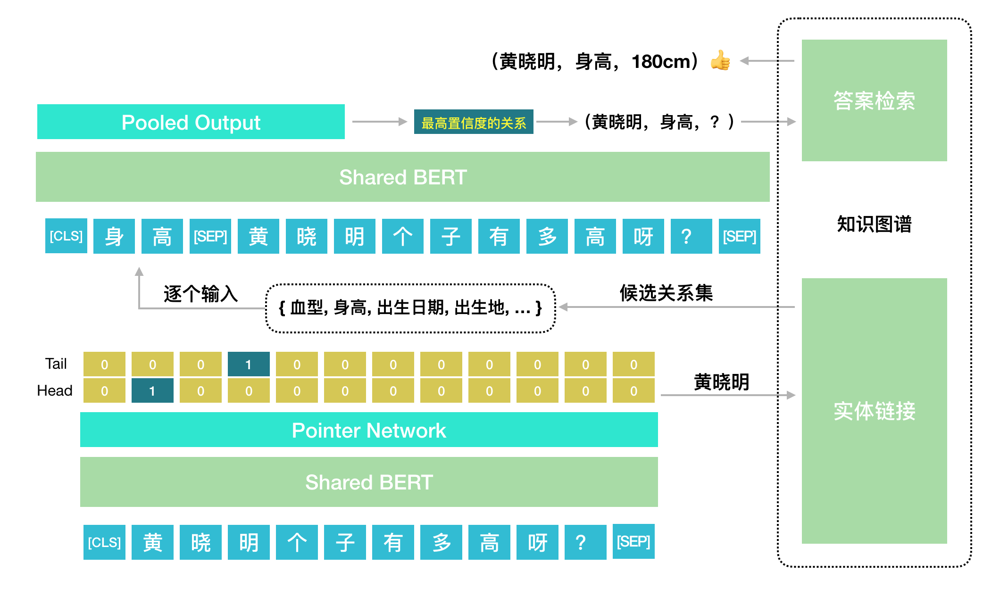

# 百科KBQA
一个基于知识图谱的端到端问答系统，分为实体识别和关系分类两部，在BERT基础上做多任务联合训练。


## Definition
- 三元组：包含主谓宾，格式形如`(subject, predicate, object)`的数据；
- 问题：也称query，该项目中的问题一般都是询问object；
- 知识图谱：包含大量三元组的知识库，在该项目中为百科知识。

## Introduction
本项目实现了一个基于BERT的端到端的KBQA系统，支持单跳问题的查询。主要分为两个部分：
1. 实体识别(NER)：输入一个问句，找出该问句的唯一核心实体(subject)；
2. 关系抽取(RE)：输入一个问句和一个关系，判断该问句是否询问了该关系(predicate)。

从下面这张图可以大概理解该项目的实现思路：


**训练过程：**
本项目用了[MT-DNN](https://zhuanlan.zhihu.com/p/66808978)的联合训练的思想，实体识别和关系抽取共用了一个BERT作为表达层。
1. 其中由于问题中确定只存在一个主语实体，NER部分就是一个简单的BERT+Pointer-Network的结构；
2. 关系抽取的部分，在训练时涉及到负采样。方案如下：先根据gold triple中的主语，到图谱中找到该主语对应的所有关系(predicate)，剔除掉正确的关系后，剩下的关系作为负样本。正样本监督信号为1，负样本为0。

**推理过程：**
1. NER过程就很简单不赘述；
2. RE时，先用NER找到的主语，去图谱中找到其对应的所有关系，再逐个和问题配对，放到re模型中，选取置信度最高的关系，到图谱中寻找最后的问题答案(object)。

## Data
Knowledge Graph:
[NLPCC 2017图谱(提取码：khrv)](https://pan.baidu.com/s/1yO77WW5XQwA_RtkxRHI7Yw)

QAs:
[NLPCC 2016KBQA](https://github.com/fyubang/Joint-BERT-KBQA/tree/master/data)

## Environment
```
Python3.6
PyTorch>=1.0
numpy==1.14.6
tqdm==4.31.1
```

## Usage

1. 用`nega_sampling.py`完成对训练数据的负采样；
2. 用`graph.py`处理图谱数据，序列化为字典；
3. 在`config.py`中配置超参；
4. 写`run.sh`，选择训练、验证还是测试模式。

训练：
```
export CUDA_VISIBLE_DEVICES=1
python main.py \
    --do_train_and_eval \
    --model_dir experiments/debug \
    --nega_num 8 \
    --learning_rate 5e-5 \
    --batch_size 32 \
    --epoch_num 3
```

预测：
```
export CUDA_VISIBLE_DEVICES=1
python main.py \
    --do_predict \
    --model_dir experiments/debug \
```

## Result
| BERT-KBQA  | Accuracy |
| ---------- | --------- |
| 主语   | 97.27     |
| 关系   | 90.07     |
| 答案   | 91.31     |

## Example
一个测试模式时的例子：

